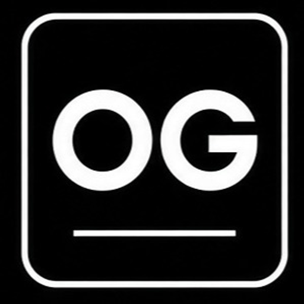
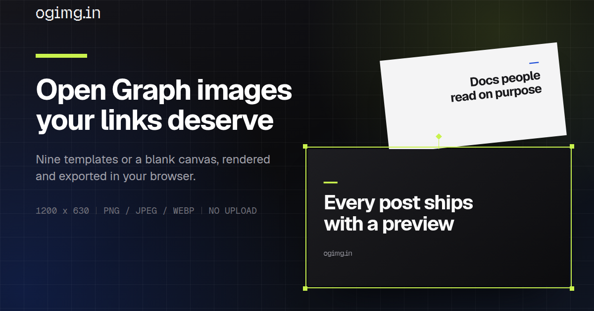
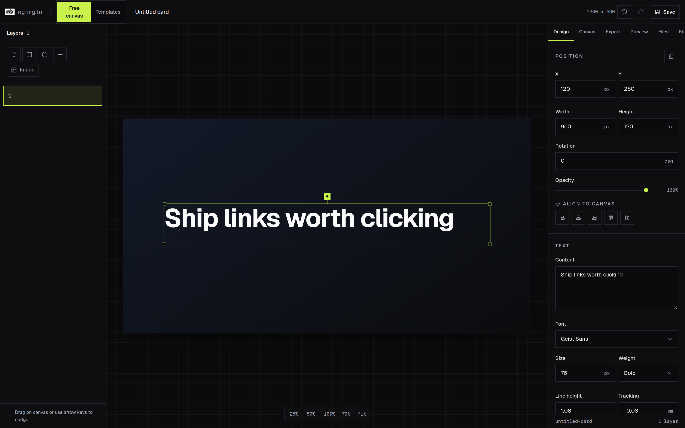

<p align="center">
  
</p>

<h1 align="center">ogimg.in</h1>

<p align="center">
  Open Graph images your links deserve.
</p>

<p align="center">
  Start from a template, or compose one from scratch on a free canvas with full layer control.
</p>

<p align="center">
  
  
  
  
  
  <a href="./LICENSE"></a>
</p>

## Two ways to work

**Templates** are opinionated layouts for the common cases: launch cards, blog covers, changelog boards,
podcast art, and more. Each one exposes its own controls for copy, type, colour, and background.

**The free canvas** has no fixed layout. Place text, shapes, and images as layers, drag them with snap
guides, and set every value yourself.

Both share the same shell: undo and redo, saved projects, brand kits, a social preview simulator, and
PNG / JPEG / WebP export at 1x, 2x, or 3x.

## Editor features

- Layer stack for text, shapes, and images with reorder, hide, lock, duplicate, and delete
- Drag, resize, rotate, and arrow-key nudge with snapping to canvas edges and other layers
- Typography per layer: 16 self-hosted families, weight, size, line height, tracking, case, alignment
- Canvas background with solid, gradient, and 27 preset fills plus grid, graph, and dots overlays
- Platform sizes for Open Graph, X, LinkedIn, Product Hunt, YouTube, square posts, and stories, plus
  custom dimensions that rescale existing layers
- Social preview drawer for X, LinkedIn, Discord, and Slack, with copyable `og:image` head tags and a crop warning when the canvas does not match the card
- Saved projects and brand kits in local storage, with an autosaved draft for the free canvas
- Fonts embedded into the exported file, so the image renders the same on any machine
- No backend: images, copy, and projects never leave the browser tab

## Keyboard shortcuts

| Shortcut | Action |
| --- | --- |
| `Ctrl/Cmd + Z` | Undo |
| `Ctrl/Cmd + Shift + Z` | Redo |
| `Ctrl/Cmd + S` | Save project to this browser |
| `Ctrl/Cmd + D` | Duplicate the selected layer |
| Arrow keys | Nudge the selected layer (`Shift` for 10px) |
| `Delete` | Remove the selected layer |
| `Esc` | Deselect, or close the preview drawer |

## Previews

The site card, rendered by the app itself:

<p align="center">
  
</p>

The free canvas editor:

<p align="center">
  
</p>

Every template in the gallery is rendered live from its React component, so there are no
screenshots to keep in sync.

## Use cases

- Blog and documentation covers
- Product launch link previews
- Changelog and release announcement cards
- Podcast episode art
- Portfolio and project social cards

## Tech stack

- Next.js 16 (App Router)
- React 19
- TypeScript 5
- Tailwind CSS 4
- Framer Motion
- Phosphor Icons

## Getting started

```bash
npm install
npm run dev
```

Open `http://localhost:3000` for the landing page, `/studio` for the free canvas, and
`/template-gallery` for the templates.

## Project structure

```text
app/
  components/
    editor/        editor shell, canvas, panels, export, preview simulator
    landing/       landing page sections
    templates/     the nine template components plus shared background and font data
  lib/editor/      document types, history, persistence, platform sizes, export pipeline
  studio/          free canvas route
  editor/[templateId]/  template editor route
  template-gallery/
  changelog/
public/
  icon.png             app icon, also used as the in-app brand mark
  editor-preview.png   screenshot of the canvas editor
  og-card.png           the site card
```

## Scripts

- `npm run dev` - start local development server
- `npm run build` - create production build
- `npm run start` - run production build locally
- `npm run lint` - run ESLint

## Notes

- The export pipeline serialises the canvas into an SVG `foreignObject`, inlines every computed style,
  and embeds the fonts as base64 before rasterising. No server is involved at any point.
- Templates are described by a control schema in `app/lib/editor/templateSchema.ts`, so adding a template
  does not add conditionals to the editor.

## Contributing

Issues and pull requests are welcome. For larger changes, open an issue first with scope and screenshots.

## License

Licensed under the [MIT License](./LICENSE).